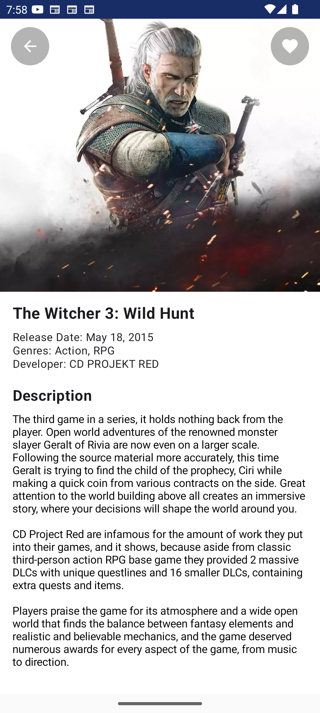
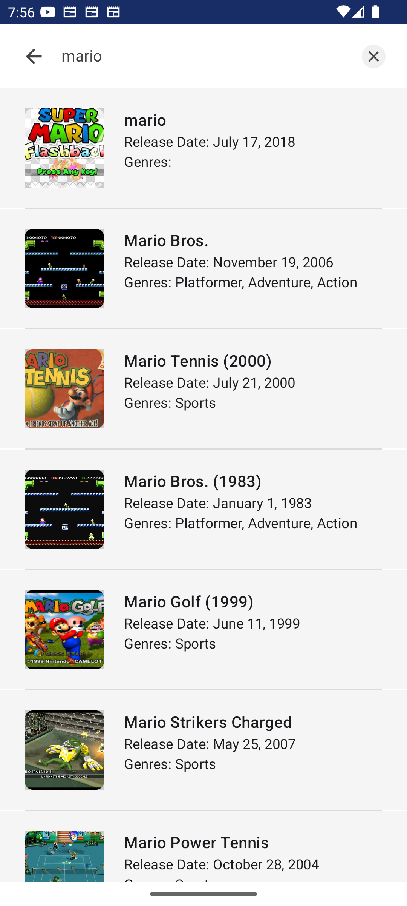

# Game List Android App using RAWG API

This is an Simple Android application that displays a list of games using the RAWG API. The application has 4 main screens: List, Detail, Search, and Favorite.

## Screenshots

               

## Features

1. **List Screen**: Displays a list of available games.
2. **Detail Screen**: Shows details of the selected game.
3. **Search Screen**: Allows users to search for games by name.
4. **Favorite Screen**: Displays a list of games marked as favorites by the user.


## Requirements

- **Programming Language**: Kotlin
- **Architecture**: MVVM (Model-View-ViewModel)
- **Unit Testing**: Using Espresso, Mockito, JUnit
- **Modularization**: By feature
- **Reactive Programming**: Using Kotlin Flow
- **Dependency Injection**: Using Hilt
- **Kotlin DSL**: Implement Domain-Specific Language
- **Dependency Management**: Using Version Catalog
- **Logging**: Using Timber library
- **Database**: Using Room library
- **UI Development**: Using Jetpack Compose
- **Networking**: Using Ktor
- **UI Design**: Implementing Atomic Design methodology
- **Unit Test Coverage**: Using Kover

## Installation

1. Clone this repository:
    ```bash
    git clone https://github.com/rikyahmad/GameListApp.git
    ```
2. Open the project in Android Studio.
3. Sync the project with Gradle.
4. Add your `API_KEY` in the `local.properties` file:
    ```properties
    API_KEY=your_rawg_api_key
    ```

## Usage

1. **List Screen**: Open the app to see a list of games fetched from the RAWG API.
2. **Detail Screen**: Tap on any game in the list to view its details.
3. **Search Screen**: Use the search functionality to find specific games by name.
4. **Favorite Screen**: Mark games as favorites and view them in the favorites section.

## License

This project is licensed under the MIT License. See the [LICENSE](LICENSE) file for more details.

---

Happy coding! 🚀
